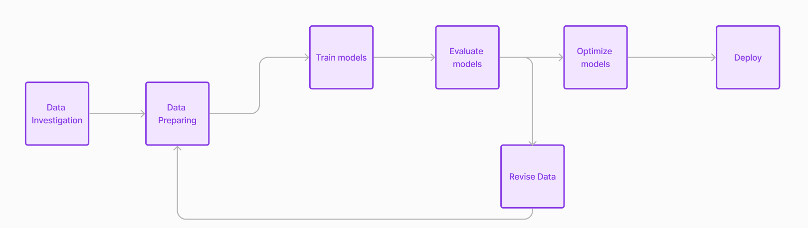
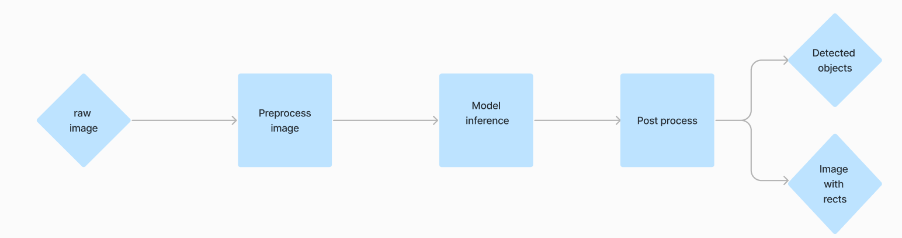

# Human detector
End-to-end pipeline of human detection using deep neural network

## Problem
The task of detecting people in images is an
important applied task in the field of machine learning.
Detecting the presence of people in a photo can help automate the
search for people in photos. 
This can be used, for example, as part of a face recognition
pipeline. Also, detecting people in the picture can be useful 
for security systems to notice if someone is approaching your house.

## Data

To train models [human dataset](https://www.kaggle.com/datasets/fareselmenshawii/human-dataset) is used. 
The dataset contains 17,300 images with images of people. 
This amount of data is quite enough to achieve good quality.
At the same time, the pictures themselves are heterogeneous,
that is, there are a lot of types of people on them and all
the photos are taken from different angles, which will help develop
the generalizing ability of the model. The problem with the data
is that the images are of high quality, which means that recognition
will work worse on images of poor quality. To solve this problem,
various augmentations are used to train the model, changing the 
image quality.

## Models & Pipeline

[YOLOv5](https://github.com/ultralytics/yolov5) will act as the main model for detecting people.
Its main advantages over other models lie in the fact that it has
a low weight, it can be optimized into various formats, including
mobile devices. At the same time, the quality of the model,
as practice shows, is quite good, which, combined with the high rate
of inference, makes the YOLOv5 an excellent candidate.

On the picture below project pipeline is shown. Firstly, we collect raw data, clean if it needs, prepare to yolo format
(if data is not in yolo format). Then, we train our models and estimate it. If quality is good enough we optimize it and deploy.




## Production pipeline

Having raw image in the beginning of inference pipeline, we prepare it by some functions.
After image is prepared, model inference can be run. Then, we have to post process raw prediction and return
image with drawn rectangles and coordinates of rectangles. The picture is shown below.



## QuickStart

* Environment preparing:

```bash
git clone https://github.com/z4-qqq/human-detector.git
poetry install
```

